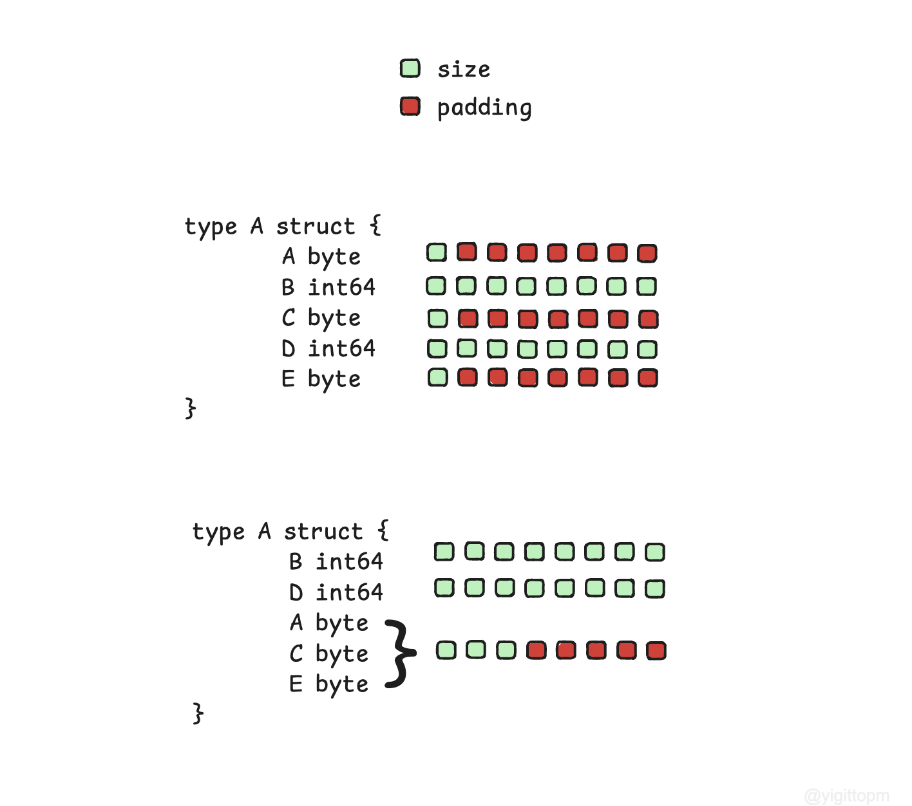

# Go Memory Alignment Analiz Aracı
 Bu araç, Go dilinde yazılmış yapıların (struct) bellek hizalamasını analiz etmek ve optimize etmek için geliştirilmiştir. 
Dosyalarınızı gezerek **.go** uzantılı dosyaları bulur ve içerisindeki struct yapılarını analiz edip değiştirir. 
Go'nun bellekteki verileri hizalama şekli, performans açısından kritik öneme sahiptir. Yanlış hizalanmış yapılar, daha fazla bellek tüketimine ve düşük performansa neden olabilir.





Bu repo, aşağıdaki özellikleri sunar:

- [x] CLI tabanlı kullanım ve kolay entegrasyon
- [x] Basit struct yapılarını analiz etme ve düzenleme
- [ ] Karmaşık struct yapılarını analiz etme ve düzenleme
- [ ] Gereksiz boşlukları (padding) ve bellek israfını tespit etme
- [ ] Performans iyileştirmeleri için önerilerde bulunma
- [ ] Analizleri raporlama

Kendi projelerinizde bellek optimizasyonu yapmanıza yardımcı olmak için geliştirilmiştir. Hem küçük projelerde hem de büyük çaplı sistemlerde faydalı olabilir.


### Kurulum

```bash
    go install github.com/yigttopm/padding0@latest
```

Çalıştığınız Go projenizin kök dizinine gidin ve aşağıdaki komutu çalıştırın:

```bash
    padding0
```

ya da projenizin yolunu belirterek çalıştırabilirsiniz:

```bash
    padding0 -d="path/to/your/project"
```

### Örnek
Projenizde kullandığınız örnek bir struct:
```go
package main

// Total size with padding: 40 bytes
type A struct {
	A byte  // 1 byte
	B int64 // 8 byte
	C byte  // 1 byte
	D int64 // 8 byte
	E byte  // 1 byte
}
```

ve bu aracı çalıştırdıktan sonra:

```go
package main

// Total size with padding: 24 bytes
type A struct {
	B int64 // 8 byte
	D int64 // 8 byte
	A byte  // 1 byte
	C byte  // 1 byte
	E byte  // 1 byte
}
```